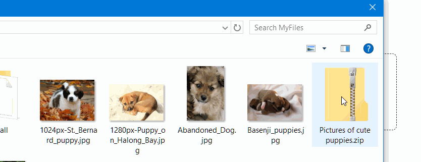

&nbsp;&nbsp;&nbsp;



# 📤 dash-uploader

The alternative upload component for [Dash](https://dash.plotly.com/) applications. 


## Table of contents
- [Short summary](#short-summary)
- [dash-uploader vs. dcc.Upload](#dash-uploader-vs-dccupload)
- [Installing](#installing)
- [Quickstart](#quickstart)
  - [Simple example](#simple-example)
  - [Example with callback](#example-with-callback-and-other-options)
- [Contributing](#contributing)
- [Documentation](#documentation)
- [Changelog](#changelog)
- [Credits](#credits)

## Short summary
&nbsp;&nbsp;&nbsp;&nbsp;&nbsp; 💾 Data file size has no limits. (Except the hard disk size)<bR>
&nbsp;&nbsp;&nbsp;&nbsp;&nbsp; ☎ Call easily a callback after uploading is finished.<br>
&nbsp;&nbsp;&nbsp;&nbsp;&nbsp; 📤 Upload files using [resumable.js](https://github.com/23/resumable.js) <br>
&nbsp;&nbsp;&nbsp;&nbsp;&nbsp; 📦 All JS and CSS bundled with the package. No need for network calls for CSS/JS.<br>
&nbsp;&nbsp;&nbsp;&nbsp;&nbsp; ✅ Works with Dash 1.1.0.+ & Python 3.6+. (Possibly with other versions, too)<br>


### dash-uploader vs. [dcc.Upload](https://dash.plotly.com/dash-core-components/upload)


|                       | dash-uploader                                      | [dcc.Upload](https://dash.plotly.com/dash-core-components/upload)                                                                                                                    |
| --------------------- | -------------------------------------------------- | ------------------------------------------------------------------------------------------------------------------------------------------------------------------------------------ |
| Underlying technology | [resumable.js](http://www.resumablejs.com/)        | HTML5 API                                                                                                                                                                            |
| File size             | Unlimited                                          | max ~150-200Mb ([link](https://community.plotly.com/t/dash-upload-component-decoding-large-files/8033/11))                                                                           |
| Uploads to            | Hard disk (server side)                            | First to browser memory (user side) Then, to server using callbacks.                                                                                                                 |
| Data type             | Uploaded as file; no need to parse at server side. | Uploaded as byte64 encoded string  -> Needs parsing                                                                                                                                  |
| See upload progress?  | Progressbar out of the box                         | No upload indicators out of the box. Generic loading indicator possible. [Progressbar not possible](https://community.plotly.com/t/upload-after-confirmation-and-progress-bar/7172). |

# Installing
```
pip install dash-uploader
```

# Quickstart

Full documentation [here](docs/dash-uploader.md) 
>⚠️**Security note**: The Upload component allows POST requests and uploads of arbitrary files to the server harddisk and one should take this into account (with user token checking etc.) if used as part of a public website! For this you can utilize the  `http_request_handler` argument of the [du.configure_upload](https://github.com/np-8/dash-uploader/blob/master/docs/dash-uploader.md#duconfigure_upload). (New in version 0.5.0)

## Simple example

```python
import dash
import dash_html_components as html
import dash_uploader as du

app = dash.Dash(__name__)

# 1) configure the upload folder
du.configure_upload(app, r"C:\tmp\Uploads")

# 2) Use the Upload component
app.layout = html.Div([
    du.Upload(),
])

if __name__ == '__main__':
    app.run_server(debug=True)

```

## Example with callback (and other options)
- **New in version 0.3.0:** New short callback syntax using `@du.callback`.
- **New in version 0.2.0:** The configure_upload accepts additional parameter `use_upload_id`, which is a boolean flag (Defaults to True). When True, the uploaded files are put into subfolders `<upload_folder>/<upload_id>`. This way different users can be forced to upload to different folders. 

```python
from pathlib import Path
import uuid

import dash_uploader as du
import dash
import dash_html_components as html
from dash.dependencies import Input, Output, State

app = dash.Dash(__name__)

UPLOAD_FOLDER_ROOT = r"C:\tmp\Uploads"
du.configure_upload(app, UPLOAD_FOLDER_ROOT)

def get_upload_component(id):
    return du.Upload(
        id=id,
        max_file_size=1800,  # 1800 Mb
        filetypes=['csv', 'zip'],
        upload_id=uuid.uuid1(),  # Unique session id
    )


def get_app_layout():

    return html.Div(
        [
            html.H1('Demo'),
            html.Div(
                [
                    get_upload_component(id='dash-uploader'),
                    html.Div(id='callback-output'),
                ],
                style={  # wrapper div style
                    'textAlign': 'center',
                    'width': '600px',
                    'padding': '10px',
                    'display': 'inline-block'
                }),
        ],
        style={
            'textAlign': 'center',
        },
    )


# get_app_layout is a function
# This way we can use unique session id's as upload_id's
app.layout = get_app_layout


@du.callback(
    output=Output('callback-output', 'children'),
    id='dash-uploader',
)
def get_a_list(filenames):
    return html.Ul([html.Li(filenames)])


if __name__ == '__main__':
    app.run_server(debug=True)

```


## Contributing


| What?                                | How?                                                                                                                                                                                                                                         |
| :----------------------------------- | :------------------------------------------------------------------------------------------------------------------------------------------------------------------------------------------------------------------------------------------- |
| 🐞 Found a bug?                       | 🎟 <a href="https://github.com/np-8/dash-uploader/issues">File an Issue</a>                                                                                                                                                                   |
| 🙋‍♂️ Need help?                         | ❔  <a href="https://stackoverflow.com/questions/ask">Ask a question on StackOverflow</a> <br><a href="https://community.plotly.com/t/show-and-tell-dash-uploader-upload-large-files/38451">📧 Use this thread on community.plotly.com</a>     |
| 💡  Want to submit a feature request? | <a href="https://community.plotly.com/t/show-and-tell-dash-uploader-upload-large-files/38451">🎭 Discuss about it on community.plotly.com</a><br><a href="https://github.com/np-8/dash-uploader/issues">🎫 File an Issue (feature request)</a> |
| 🧙  Want to write code?               | 🔥 <a href="./docs/CONTRIBUTING.md">Here's how you get started!</a>                                                                                                                                                                           |
## Documentation
- See: [Documentation](docs/dash-uploader.md) and [Developer documentation](docs/CONTRIBUTING.md) .

## Changelog

- See: [Changelog](./docs/CHANGELOG.md)
## Credits
- History: This package is based on the React 16 compatible version [dash-resumable-upload](https://github.com/westonkjones/dash-resumable-upload) (0.0.4) by [Weston Jones](https://github.com/westonkjones/) which in turn is based on [dash-resumable-upload](https://github.com/rmarren1/dash-resumable-upload) (0.0.3) by [Ryan Marren](https://github.com/rmarren1) 
- The package boilerplate is taken from the [dash-component-boilerplate](https://github.com/plotly/dash-component-boilerplate).
- The uploading JS function utilizes the [resumable.js](http://www.resumablejs.com/) (1.1.0).
- The JS component is created using [React](https://github.com/facebook/react) (17.0.x)
- The CSS styling is mostly from [Bootstrap](https://getbootstrap.com/) 4.
