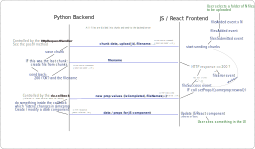

# CONTRIBUTING

## TABLE OF CONTENTS
- [1. How to improve this package?](#1-how-to-improve-this-package)
- [2. Setting up development environment](#2-setting-up-development-environment)
- [3. Package structure](#3-package-structure)
  - [3.1 Highlights of package structure](#31-highlights-of-package-structure)
  - [3.2 Other (Package structure)](#32-other-package-structure)
- [4. Developing](#4-developing)
  - [4.1 Developing the Python code](#41-developing-the-python-code)
- [5. Testing](#5-testing)
  - [5.1 Manually](#51-manually)
  - [5.2 With pytest (automatic tests)](#52-with-pytest-automatic-tests)
  - [5.3  Testing React components without python](#53--testing-react-components-without-python)
- [6. Creating new version to pip](#6-creating-new-version-to-pip)
- [7.  How does dash-uploader work internally?](#7--how-does-dash-uploader-work-internally)
- [8.  More help?](#8--more-help)
## 1. How to improve this package?

Maybe you already have an idea. If not, see if there are any open [issues](https://github.com/np-8/dash-uploader/issues) that need help. 
## 2. Setting up development environment
- Clone this repository. Change current directory to project root.
- Install [npm and Node.js](https://nodejs.org) for building JS.
- Install the JS dependencies by running `npm install` on the project root. This will create `node_modules` directory.
- Create python virtual environment and activate it
- `pip install` this package in editable state with the `[dev]` flag.
```
python -m pip install -e <path_to_this_folder>[dev]
```


## 3. Package structure

### 3.1 Highlights of package structure
```
dash_uploader/
  * python source code of this package
    __init__.py
  _build/
    * Auto-generated python & JS code
    * Do not edit these by hand!
      _imports_.py
      <Component>.py <-- for each component
      dash_uploader.min.js
      dash_uploader.min.js.map
      metadata.json
      package-info.json
    
devscripts/
  * used during "npm run build"
  
src/
  demo/
    * Example JS demo. Just for testing React code
      with "npm start"
  lib/
    * React components (The JS/React source code)

package.json
  * Defines JS dependencies
  * Defines npm scripts

usage.py
  * Example file
  * Run with `python usage.py`
```
### 3.2 Other (Package structure)
```
assets/
  * Assets just for the demo (usage.py)
index.html
  * Needed for testing (with npm run)
inst/
  * Some kind of intermediate storage for JS files 
    (before copying to dash_uploader)
  * Automatically generated with "npm run build"
node_modules/
  * JS dependencies
  * Automatically created by "npm install"
venv/
  * python dependencies (virtual environment)
  * Created with "python -m venv venv"
```
## 4. Developing

### 4.1 Developing the Python code

- Edit the non-auto-generated files in `dash_uploader` 
- The used code formatter is [black](https://github.com/psf/black).
### 4.2 Developing the React/JS code
- Edit the react.js files in `src/lib/components/`<br>


#### 4.2.1  Building: React.js -> JS & Python
If you edited the JS files, you need to build them. You also need to build the JS files the first time you try to use the cloned package. 

Run in the project root
```
npm run build
```
This will create all the auto-generated (JS, json, python) files into the `dash_uploader/_build` folder.


## 5. Testing

### 5.1 Manually

You can test the code manually by running the demo page
1. Run `python usage.py`
2. Visit http://127.0.0.1:8050/ in your web browser

### 5.2 With pytest (automatic tests)

*If testing for the first time, install the testing requirements with*
```
python -m pip install -r tests/requirements.txt
```

You can test the code automatically by running 

```
python -m pytest
```

- Make sure you have built the JS first with `npm run build` 
- The `app`  defined in the `usage.py` will be available to the tests. See the tests in the `tests/test_usage.py` to get a grasp on how it works. You could also add other `app`s available to the tests in similar manner.
- More about testing Dash components [here](https://dash.plotly.com/testing).
- If you get an error similar to 
```
selenium.common.exceptions.SessionNotCreatedException: Message: session not created: This version of ChromeDriver only supports Chrome version 90
Current browser version is 93.0.4577.82 with binary path C:\Program Files (x86)\Google\Chrome\Application\chrome.exe
```
then, run

```
python -m pip install --upgrade --force-reinstall chromedriver-binary-auto
```

### 5.3  Testing React components without python
*This is WIP; probably needs some fixing*<br>
- Before creating the "python/Dash" versions, it is possible to test the component(s) by
- Editing the content of `src/demo/index.js`, if you wish.
- Then, running
```
npm start
```
- Then, go to url `http://127.0.0.1:55555`. 
- The url can be changed in the package.json -> scripts -> start, by changing the `host` argument to the [`webpack-serve`](https://www.npmjs.com/package/webpack-serve).
- **Note**: There is not handler for POST requests in the demo! (the Upload component will not work without a POST handler)

## 6. Creating new version to pip

*only applicable to people with access to the PyPI package*
- Update version in `package.json`
- Create new `dash_uploader-x.x.x.tar.gz` with 
```
python .\setup.py sdist
```
- Upload to pip with
```
twine upload .\dist\dash_uploader-x.x.x.tar.gz
```
## 7.  How does dash-uploader work internally?

Here is a diagram that tries to explain how dash-uploader works under the hood. If you find a place for improvement, please [submit a PR](https://github.com/np-8/dash-uploader/issues).


[](https://raw.githubusercontent.com/np-8/dash-uploader/master/docs/how-dash-uploader-works.svg)

## 8.  More help?
Read also the automatically generated README text at [README-COOKIECUTTER.md](README-COOKIECUTTER.md).